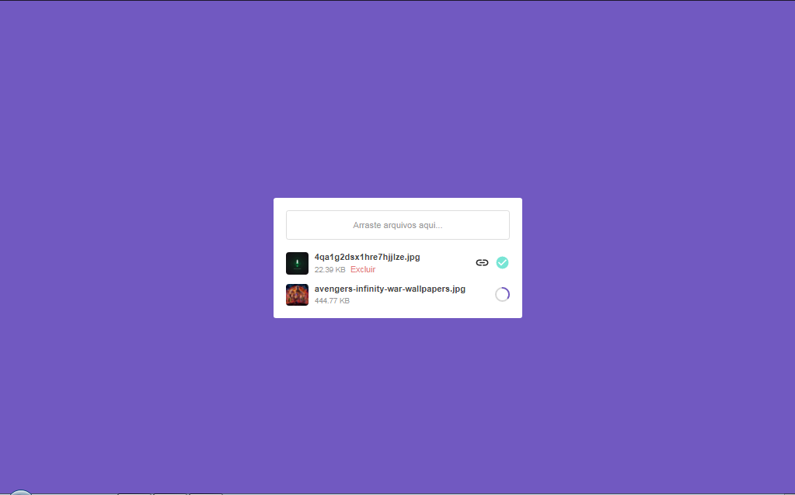

<h1 align="center">
  UploadRocketseat
</h1>

  <a href="#-tecnologias">Tecnologias</a>&nbsp;&nbsp;&nbsp;|&nbsp;&nbsp;&nbsp;
  <a href="#-projeto">Projeto</a>&nbsp;&nbsp;&nbsp;|&nbsp;&nbsp;&nbsp;
  <a href="#-como-começar">Como Começar</a>&nbsp;&nbsp;&nbsp;|&nbsp;&nbsp;&nbsp;
  <a href="#-como-contribuir">Como Contribuir</a>&nbsp;&nbsp;&nbsp;|&nbsp;&nbsp;&nbsp;
  <a href="#memo-licença">Licença</a>

 

  

 

  

## 🚀 Tecnologias

Esse projeto foi desenvolvido com as seguintes tecnologias:

- [ReactJS](https://reactjs.org/)
- [Node.js](https://nodejs.org/en/)

## 💻 Projeto

O UploadRocketseat é uma aplicação de enviar imagens como progresso que se foi enviado ou não

## 🔥 Como Começar

Para começarmos você precisa ter o [Node.js](https://nodejs.org/en/) e o [Git](https://git-scm.org/) instalados na sua máquina

- 1 - Faça um clone desse repositório `git clone https://github.com/pedroduarte2005/uplaodrocketseat.git`;
- 2 - Entre na pasta `cd uploadrocketseat`;
- 3 - Entre na pasta `cd backend` e rode `yarn` ou `npm install` para instalar as dependências e rode `yarn dev` ou `npm run dev`;
- 5 - Entre na pasta `cd frontend` e rode `yarn` ou `npm install` para instalar as dependências e rode `yarn start` ou `npm start`;

## ⚡️ Como contribuir

- Faça um fork desse repositório;
- Cria uma branch com a sua feature: `git checkout -b minha-feature`;
- Faça commit das suas alterações: `git commit -m 'feat: Minha nova feature'`;
- Faça push para a sua branch: `git push origin minha-feature`.

Depois que o merge da sua pull request for feito, você pode deletar a sua branch.

## :memo: Licença

Esse projeto está sob a licença MIT. Veja o arquivo [LICENSE](.github/LICENSE.md) para mais detalhes.

---

Feito com ♥ by Pedro Duarte :wave:
